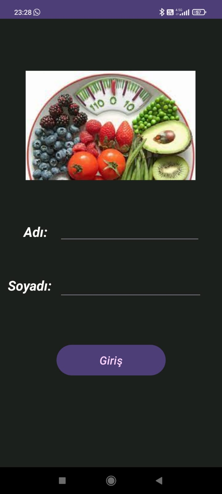
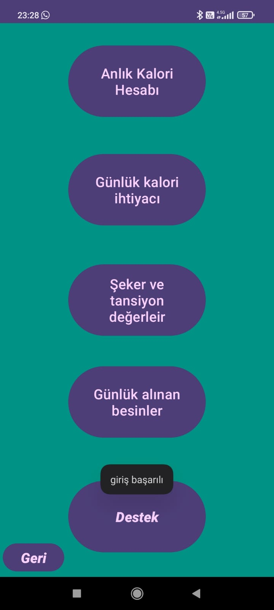
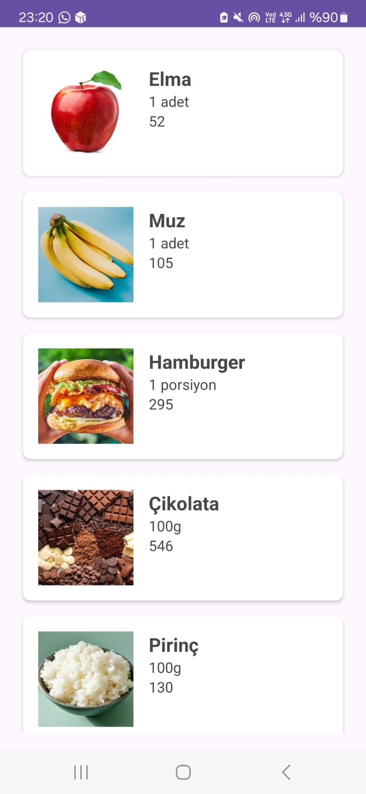
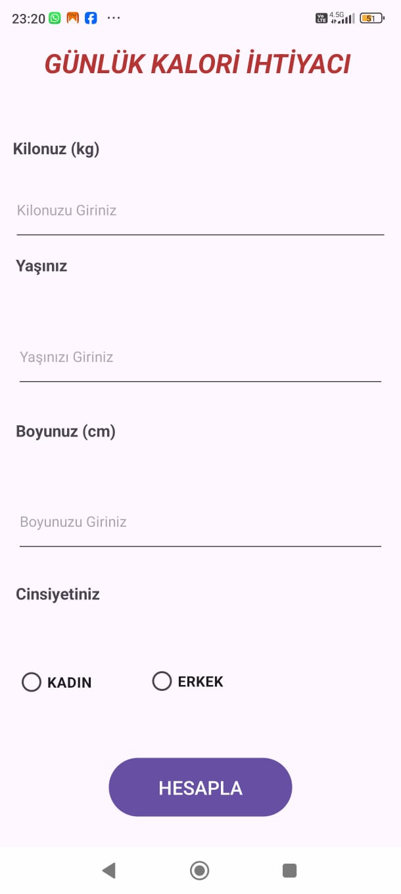
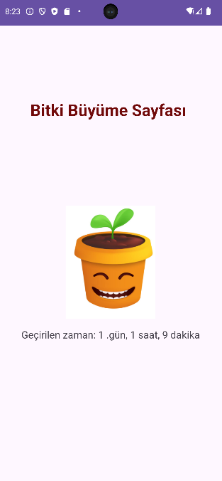

# Mobil Sağlıklı Beslenme Uygulaması
# Projenin Başlığı: Sağlıklı Yaşam Rehberi

## Proje Açıklaması:
Sağlıklı Yaşam Rehberi, kullanıcıların sağlıklı beslenmelerine ve kilo vermelerine yardımcı olmayı amaçlayan bir mobil uygulamadır. Uygulama, kullanıcıların kalori alımlarını takip etmelerine, besin değerlerini takip etmelerine ve sağlıklı beslenme alışkanlıkları geliştirmelerine yardımcı olacak araçlar sunar.

## Kullanılan Teknolojiler
- **Kotlin**: Android uygulama geliştirme için modern ve popüler bir dil.
- **Android Studio**: Android uygulamaları geliştirmek için resmi IDE.
- **Firebase**: Kullanıcı kimlik doğrulama, veri depolama ve gerçek zamanlı veri tabanı gibi hizmetler sunar.
- **SQLite**: Mobil uygulamalar için yerel veri depolama için popüler bir veritabanı motoru.

  ## Ekran Görüntüleri
  

### Anlık Kalori Hesabı

### Günlük Kalori İhtiyacı

### Bitki Büyütme Sayfası

## Kullanılan Teknolojilerin Sebebi:
Kotlin, Android uygulama geliştirme için modern ve popüler bir dildir.
Android Studio, Android uygulamaları geliştirmek için resmi bir IDE'dir.
Firebase, kullanıcı kimlik doğrulama, veri depolama ve gerçek zamanlı veri tabanı gibi mobil uygulama geliştirme için çeşitli hizmetler sunar.
SQLite, mobil uygulamalar için yerel veri depolama için popüler bir veritabanı motorudur.

## Karşılaşılan Zorluklar:
Kullanıcıların günlük kalori alımlarını doğru bir şekilde takip etmelerini sağlamak
Geniş bir besin veri tabanı oluşturmak ve güncel tutmak
Kullanıcıları uygulamaya bağlı tutmak

## Gelecekte Uygulanacak Özellikler:
Kişiye özel beslenme planları
Tarifler
Egzersiz takibi
Arkadaşlarla bağlantı kurma

## Katkıda Bulunma
Katkıda bulunmak için lütfen [CONTRIBUTING.md](CONTRIBUTING.md) dosyasını inceleyin.

1. Projeyi fork'layın.
2. Yeni bir dal oluşturun (`git checkout -b yeni-ozellik`).
3. Değişikliklerinizi commit edin (`git commit -am 'Yeni özellik ekle'`).
4. Dalınıza push edin (`git push origin yeni-ozellik`).
5. Bir Pull Request oluşturun.

## Proje Nasıl Kullanılır:
Uygulamayı açın ve bir hesap oluşturun veya mevcut bir hesaba giriş yapın.
Kişisel bilgilerinizi girin (yaş, cinsiyet, boy, kilo, vb.).
Günlük kalori hedefinizi ayarlayın.
Yediğiniz yiyecekleri ve içecekleri girin.
Günlük kalori alımınızı ve besin değerlerinizi takip edin.
Hedeflerinize ulaşmanıza yardımcı olacak ipuçları ve tavsiyeler alın.

## Katkıda Bulunanlar:
Nurhayat DERE
Gülizar TUNÇ
Gülendam ÇETİN

## Lisans:
Bu proje Apache Lisansı 2.0 altında lisanslanmıştır.
